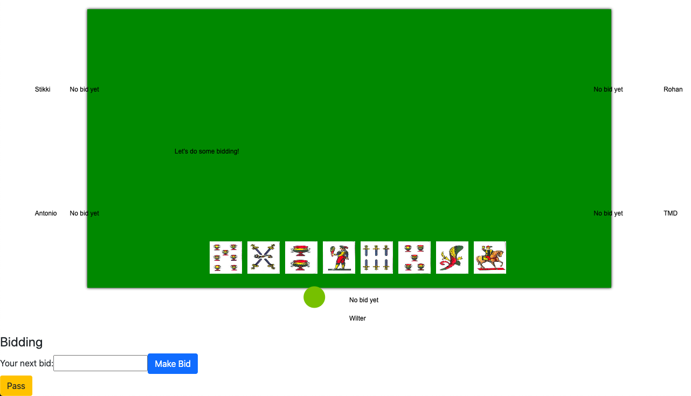

# briscola-5-person
The goal of this game is to be able to play 5 person briscola.

The database, and much of the application, is designed much more generically than just for briscola, but that's the main motivation for the application. As a result, it's the only fully supported game.

## Design
This app was built using Ruby 2.7.1, Rails 6.0 and React 16.13.1 backed by Redux 7.2. It was designed as a single page application. The entire game state is fetched every 2 seconds and is then redrawn on the canvas (using react-konva).

The database was designed such that any set of cards / card games can be added. Take a look at `db/seed.rb` to see a full example of additions of a few games and card types. The basic premise is that each card belongs to a suit, which belongs to a card type (say Italian cards). There may be a set of games, like Briscola, that belong to a card type. Within a game, a card may have a certain value. For example, in Briscola, all aces (asso) have the value of 11 points. This information is captured in the game_value_point table.

An active_game is simply an instance of said game type. A player_active_game_bid is really a player's entry into a game with their corresponding bid information. A player_game_card is the existence of a card in an active game.

### Game Flow
Players can slowly join a game. The players are drawn around the table evenly spread out with your player being at the bottom of the screen:


Once all of the players have joined, it's bidding time. All of the cards will have been dealt out and your cards will be drawn above your name. A little green circle will appear near the name of the player whose turn it is (also true during game play)


Once bidding has completed, the highest bidder must then choose their partner card (or corresponding briscola suit). The highest bidder (and their bid) along with the partner card are always drawn in the top right corner of the page. This is important since the partner card also defines the briscola suit.


Each player then picks a card by clicking on the card and then confirming the choice. The card itself will be drawn on the table to the side or above its corresponding player. The card that is currently winning the hand will also have a star drawn beside it. The current score of the hand and leader of it are drawn in the top right of the page as well.


Once each player has played a card, the hand is complete. All of the cards still remain on the table until the first card of the next hand is played. This way we can ensure that all players were able to see the result of the previous hand.


At the end of the game, the results are shown in the middle of the table.


## Running the code
1. Clone the repo

2. Change your config/database.yml to match your desired database. Any database that Rails supports and that you're comfortable with will work. Example config/database.yml:
```
default: &default
  adapter: postgresql
  username: briscola
  password: example-briscola-password
  pool: <%= ENV.fetch("RAILS_MAX_THREADS") { 5 } %>
  timeout: 5000

development:
  <<: *default
  database: card_games_development

# Warning: The database defined as "test" will be erased and
# re-generated from your development database when you run "rake".
# Do not set this db to the same as development or production.
test:
  <<: *default
  database: card_games_test

production:
  <<: *default
  database: card_games
```

3. Set up the database. The following steps are for Postgres, but you want to do something analogous. Specifically, we are creating a postgres user that is dedicated to this app and creating the test, development and production database.
```
USER="briscola"
PASSWORD="example-briscola-password"
PROD_DATABASE_NAME="card_games"
DEV_DATABASE_NAME="card_games_development"
TEST_DATABASE_NAME="card_games_test"
sudo -u postgres psql postgres
```
On Mac:
```
psql postgres -c "CREATE USER $USER WITH ENCRYPTED PASSWORD '$PASSWORD';"
psql postgres -c "ALTER USER $USER WITH CREATEDB;"
psql postgres -c "CREATE DATABASE $PROD_DATABASE_NAME OWNER $USER;"
psql postgres -c "CREATE DATABASE $DEV_DATABASE_NAME OWNER $USER;"
psql postgres -c "CREATE DATABASE $TEST_DATABASE_NAME OWNER $USER;"
```
On Unix:
```
sudo -u postgres psql postgres -c "CREATE USER $USER WITH ENCRYPTED PASSWORD '$PASSWORD';"
sudo -u postgres psql postgres -c "ALTER USER $USER WITH CREATEDB;"
sudo -u postgres psql postgres -c "CREATE DATABASE $PROD_DATABASE_NAME OWNER $USER;"
sudo -u postgres psql postgres -c "CREATE DATABASE $DEV_DATABASE_NAME OWNER $USER;"
sudo -u postgres psql postgres -c "CREATE DATABASE $TEST_DATABASE_NAME OWNER $USER;"
```

4. Migrate the database and set up the server assets.
```
bundle install
bundle exec bin/rails db:migrate RAILS_ENV=development
bundle exec bin/rails db:migrate SECRET_KEY_BASE=production_test_key RAILS_ENV=production
bundle exec bin/rails db:seed RAILS_ENV=development
bundle exec bin/rails db:seed SECRET_KEY_BASE=production_test_key RAILS_ENV=production
yarn install
bundle exec bin/rake assets:precompile
bundle exec bin/rake assets:clobber
bundle exec bin/rake assets:precompile
```

5. Run the server: `SECRET_KEY_BASE=production_test_key bundle exec bin/rails server -e production`

### Additional Server Tips

There are a few ways to do this. If you want to simply run it in a window of yours that is active, you can run the above command. If you want to run it in the background, add `-d`.

Depending on the domain / IP you are using for your environment, you may need to add some hosts. Rails 6 performs basic Host Authorization. You can simply do something like the following in your `config/environments/production.rb`:
`["domain1", "domain2"].each { |h| config.hosts << h }`

You can also runit to run this server. The required run file for the service will end up being something as simple as:
runit service run:
#!/bin/sh
(cd /home/arocca/briscola-5-person/briscola && SECRET_KEY_BASE=production_test_key bundle exec bin/rails server -e production)

I ended up using NGINX as my web server. The following config can be used to enable HTTPS:
```
server {
    listen   443;
    server_name localhost "your other domains";
    ssl    on;
    ssl_certificate    "certificate location";
    ssl_certificate_key    "private key location";

    root "repository path"/public;

    try_files $uri/index.html $uri;

    location / {
        location ~* ^/assets/ {
            expires 1y;
            add_header Cache-Control public;

            add_header Last-Modified "";
            add_header ETag "";
            break;
        }

        # If the file exists as a static file serve it directly without
        # running all the other rewrite tests on it
        if (-f $request_filename) {
            break;
        }

        proxy_set_header  Host $host;
        proxy_set_header  X-Forwarded-For $proxy_add_x_forwarded_for;
        proxy_set_header  X-Forwarded-Proto $scheme;
        proxy_set_header  X-Forwarded-Ssl on;
        proxy_set_header  X-Forwarded-Port $server_port;
        proxy_set_header  X-Forwarded-Host $host;

        if (!-f $request_filename) {
            proxy_pass http://localhost:3000;
        }
    }

    error_page 500 502 503 504 /500.html;
    client_max_body_size 4G;
    keepalive_timeout 10;
}
```
I used Let's Encrypt and Certbot to set up my certificate and private key. I highly recommend them; very straighforward set-up:
https://letsencrypt.org/getting-started/
https://certbot.eff.org/instructions

## Potential Improvements
### Technical Improvements
- Add tests everywhere. There are no tests which is sad
- Refactor the backend endpoints to be more efficient. My desire with the first pass implementation was to get the application working (I also just wanted to play the game)
- Refactor most of the React code. There are some icky things that are done like passing the full game state around instead of the specific desired pieces.
- Implement use of JSLint and Rubocop
- Consider using GraphQL
- Dockerize website set-up. Would be nice to be simply grab an image and be able to deploy this

### Feature Improvements
- Make the UI not hideous
- Handle more games than just 5-person briscola
- Authentication and real user accounts. Right now it's simply "authentication" by name
- Add in a way to start a new game after the previous one has finished
- Filter out cards that are in your hand from the partner card selector. This is a small enhancement since selecting a card from your hand will error out, but avoiding that woud be desirable
- Use cookies to store user id instead of having to rejoin game by name
